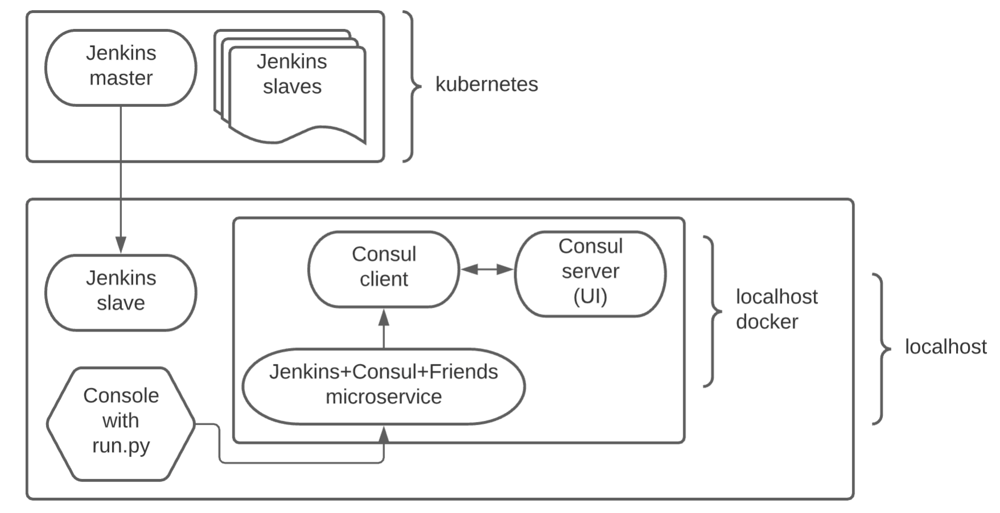

# jenkins-consul-friends

Key points:

* Start a Hashicorp Consul server container on the localhost
* Start a Hashicorp Consul client container on the localhost
* Start a Jenkins server container in the Kubernetes
* Create 2 CI CD jenkins jobs inside the Jenkins. The CI job creates a docker image out of it and save it on the local host. The CD job starts the saved docker image created in the CI job, and will result with a running docker container on the localhost

## Structure

 Components

## Requirements

Kubernetes development cluster (microk8s, minikube, kops, eks, gks, aks, etc.)

Terraform v1.0.1+

Python 3.8+

## Running

You might set the following environment variables for convenience:
* JENKINS_UI_PORT
* JENKINS_AGENT_PORT
* CONSUL_UI_PORT
* CONSUL_DNS_PORT


```
pip install -r requirements.txt
python run.py ~/.kube/config-of-k8s-development-cluster
```


## Outcome

`run.py` will display on a console something like this:

```
Microservice is deployed

set keys: curl 'localhost:9003/set-value?b=x&a=y'
get keys: curl 'localhost:9003/get-value?b&a'
Jenkins UI: localhost:46248 (admin:admin)
Consul UI: localhost:36035
Consul DNS: localhost:51808
test service discovery: dig @localhost -p 51808 jenkins-consul-friends.service.consul
Press Enter to finish...
```

Docker containers

```
$ docker ps | grep jen
63e531f46c21        a575ae275523                          "docker-entrypoint.s…"   5 minutes ago       Up 5 minutes        8300-8302/tcp, 8600/tcp, 8301-8302/ud
p, 0.0.0.0:36035->8500/tcp, 0.0.0.0:51808->8600/udp
              jenkins_consul_friends_consul_server
57a4b0741321        jenkins-consul-friends:32a1132-18     "/jenkins-consul-fri…"   35 minutes ago      Up 35 minutes       0.0.0.0:9003->9003/tcp

              jenkins-consul-friends
294c4c47f16e        a575ae275523                          "docker-entrypoint.s…"   4 hours ago         Up 4 hours          8300-8302/tcp, 8500/tcp, 8301-8302/ud
p, 8600/tcp, 8600/udp
              jenkins_consul_friends_consul_client
```

You may check bellow changes inside Consul UI also.

### Test service discovery:

```
$ dig @localhost -p 51808 jenkins-consul-friends.service.consul

; <<>> DiG 9.16.6 <<>> @localhost -p 51808 jenkins-consul-friends.service.consul
; (1 server found)
;; global options: +cmd
;; Got answer:
;; ->>HEADER<<- opcode: QUERY, status: NOERROR, id: 4630
;; flags: qr aa rd; QUERY: 1, ANSWER: 1, AUTHORITY: 0, ADDITIONAL: 1
;; WARNING: recursion requested but not available

;; OPT PSEUDOSECTION:
; EDNS: version: 0, flags:; udp: 4096
;; QUESTION SECTION:
;jenkins-consul-friends.service.consul. IN A

;; ANSWER SECTION:
jenkins-consul-friends.service.consul. 0 IN A   192.168.80.2

;; Query time: 0 msec
;; SERVER: 127.0.0.1#51808(127.0.0.1)
;; WHEN: Sat Jul 17 22:39:00 MSK 2021
;; MSG SIZE  rcvd: 82
```

### Test Key-Value storage

```
curl 'localhost:9003/set-value?b=x&a=y'
Success
```

```
curl 'localhost:9003/get-value?b&a'
x
y
```

## Particularities

The code doesn't handle resource clean up in case of incorrect termination or restart.
